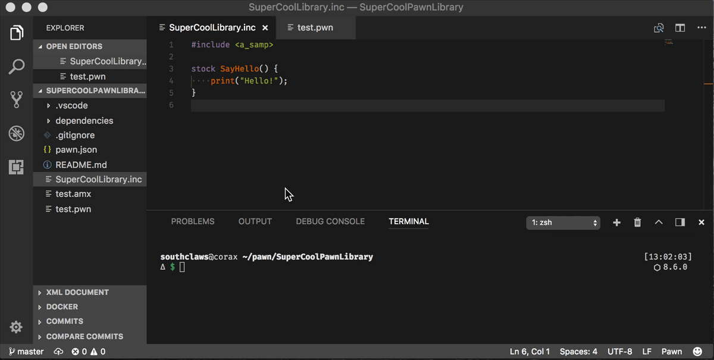
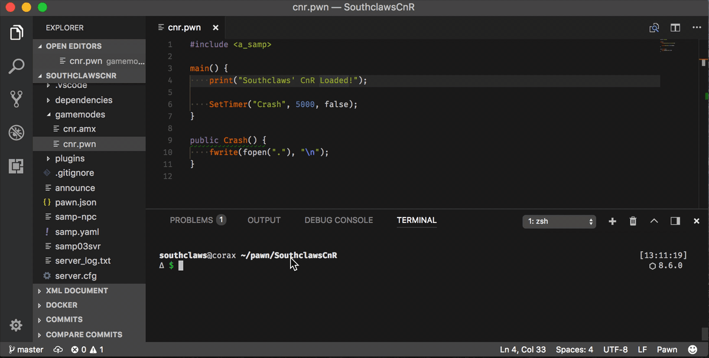
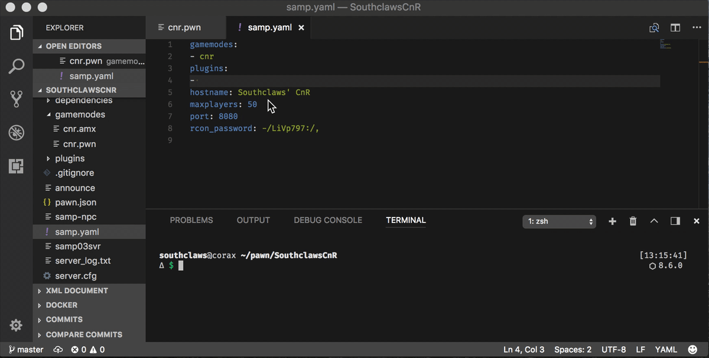

# sampctl

[](https://travis-ci.org/Southclaws/sampctl)
[](https://goreportcard.com/report/github.com/Southclaws/sampctl)
[](https://ko-fi.com/southclaws)
[](https://app.fossa.io/projects/git%2Bgithub.com%2FSouthclaws%2Fsampctl?ref=badge_shield)


The Swiss Army Knife of SA:MP - vital tools for any server owner or library
maintainer.

sampctl is a **command-line development tool** for developing SA:MP **Pawn
scripts**. It includes a **package manager**, a **build tool** and a
**configuration manager**.

If that sentence meant nothing to you, don't worry! You'll probably find use in
sampctl if you do anything related to the Pawn language. Below are some
explanations of what the terms in bold above mean.

* **command-line development tool**: Whether you're a seasoned developer or just
  a beginner, mastering the command-line on Windows and Unix systems is
  absolutely necessary to speed up your workflow, take advantage of tools (like
  this one) and just generally improve your knowledge of computing. If you've
  never opened Cmd, PowerShell (Windows) or Terminal (Mac) then
  [read this guide](https://www.learnenough.com/command-line-tutorial).
* **Pawn scripts**: This includes gamemodes, filterscripts and libraries
  (includes). sampctl introduces the concept of **packages** to the SA:MP and
  Pawn world to make everyone's life easier.
* **package manager**: This allows you to easily use and share packages, no more
  downloading outdated `.inc` files from solidfiles...
* **build tool**: Easily experiment with new versions of the compiler with a
  simpler setup and automatic download feature.
* **configuration manager**: server.cfg files can get messy and unmanageable,
  sampctl can generate this file automatically from a much cleaner looking JSON
  or YAML equivalent.

[For a **quick-start** guide, click this link!](https://github.com/Southclaws/sampctl/wiki/Quick-Overview)

## Features

As mentioned above, sampctl is a **command-line development tool** so it has no
graphical user interface. The videos below show sampctl being used with
[Visual Studio Code](https://code.visualstudio.com) which is a light-weight text
editor that works very well with sampctl to provide the perfect SA:MP/Pawn
development environment.

### Package Manager

Always have the libraries you need. Inspired by npm.


### Build/Run Tool

Use on the command-line or integrate with any editor.


Easily write and run tests for libraries or quickly run arbitrary code. Utilise
the power of Docker to run on any platform!



### Developer Tools

Quickly bootstrap new packages.


### SA:MP Server Configuration - no more `server.cfg`

Manage your server settings in JSON or YAML format


### Automatic Server Restart - no more dodgy bash scripts

Run the server from `sampctl` and let it worry about restarting in case of
crashes.



### Automatic Server and Plugin Installer

Automatically download Windows/Linux server binaries and plugins when and where
you need them.



## Installation

Installation is simple and fast on all platforms so why not give sampctl a try?

* [Linux (Debian/Ubuntu)](https://github.com/Southclaws/sampctl/wiki/Linux)
* [Windows](https://github.com/Southclaws/sampctl/wiki/Windows)
* [Mac](https://github.com/Southclaws/sampctl/wiki/Mac)

## Usage

[For a list of commands, click here.](https://github.com/Southclaws/sampctl#sampctl-1)

[Or visit the Wiki site for documentation on each feature.](https://github.com/Southclaws/sampctl/wiki).

---

## Overview

sampctl is designed for both development of gamemodes/libraries and management
of live servers.

Below is a quick overview of the best features that will help _you_ develop
faster.

### Package Management and Build Tool

If you've used platforms like NodeJS, Python, Go, Ruby, etc you know how useful
tools like npm, pip, gem are.

It's about time Pawn had the same tool.

sampctl provides a simple and intuitive way to _declare_ what includes your
project needs. After that you simply let sampctl take care of the downloading
and building.

If you release scripts, you know it's awkward to test even simple code. You need
to set up a server, compile the include into a gamemode, configure the server
and run it.

Forget all that. Just make a
[`pawn.json`/`pawn.yaml`](https://github.com/Southclaws/sampctl/wiki/Package-Definition-Reference)
in your project directory with `sampctl package init` and use
`sampctl package install` to get the includes you need:

```json
{
  "entry": "test.pwn",
  "output": "test.amx",
  "dependencies": ["sampctl/samp-stdlib", "Southclaws/formatex"]
}
```

Write your quick test code:

```pawn
#include <a_samp>
#include <formatex>

main() {
    new str[128];
    formatex(str, sizeof str, "My favourite vehicle is: '%v'!", 400); // should print "Landstalker"
    print(str);
}
```

Build with `sampctl package build` and run it with `sampctl package run`!

```bash
sampctl package run

Server Plugins
--------------
 Loaded 0 plugins.

Started server on port: 7777, with maxplayers: 50 lanmode is OFF.

Filterscripts
---------------
  Loaded 0 filterscripts.

My favourite vehicle is: 'Landstalker'!
```

You get the compiler output and the server output without ever needing to:

* visit sa-mp.com/download.php
* unzip a server package
* worry about Windows or Linux differences
* set up the Pawn compiler with your favourite editor
* make sure the Pawn compiler is reading the correct includes
* download the formatex include

[See documentation for more info.](https://github.com/Southclaws/sampctl/wiki/Packages)

### Server Configuration and Automatic Plugin Download

Use JSON or YAML to write your server config:

```json
{
  "gamemodes": ["rivershell"],
  "plugins": ["maddinat0r/sscanf"],
  "rcon_password": "test",
  "port": 8080
}
```

It compiles to this:

```conf
gamemode0 rivershell
plugins sscanf.so
rcon_password test
port 8080
(... and the rest of the settings which have default values)
```

What also happens here is `maddinat0r/sscanf` tells sampctl to automatically get
the latest sscanf plugin and place the `.so` or `.dll` file into the `plugins/`
directory.

[See documentation for more info.](https://github.com/Southclaws/sampctl/wiki/Runtime-Configuration-Reference)

---
# `sampctl`

1.7.14 - Southclaws <hello@southcla.ws>

The Swiss Army Knife of SA:MP - vital tools for any server owner or library maintainer.

## Commands (6)

### `sampctl server`

Usage: `sampctl server <subcommand>`

For managing servers and runtime configurations.

#### Subcommands (4)

### `sampctl server init`

Usage: `sampctl server init`

Bootstrap a new SA:MP server and generates a `samp.json`/`samp.yaml` configuration based on user input. If `gamemodes`, `filterscripts` or `plugins` directories are present, you will be prompted to select relevant files.

#### Flags

- `--verbose`: output all detailed information - useful for debugging
- `--version value`: the SA:MP server version to use (default: "0.3.7")
- `--dir value`: working directory for the server - by default, uses the current directory (default: ".")

### `sampctl server download`

Usage: `sampctl server download`

Downloads the files necessary to run a SA:MP server to the current directory (unless `--dir` specified). Will download the latest stable (non RC) server version unless `--version` is specified.

#### Flags

- `--verbose`: output all detailed information - useful for debugging
- `--version value`: the SA:MP server version to use (default: "0.3.7")
- `--dir value`: working directory for the server - by default, uses the current directory (default: ".")

### `sampctl server ensure`

Usage: `sampctl server ensure`

Ensures the server environment is representative of the configuration specified in `samp.json`/`samp.yaml` - downloads server binaries and plugin files if necessary and generates a `server.cfg` file.

#### Flags

- `--verbose`: output all detailed information - useful for debugging
- `--dir value`: working directory for the server - by default, uses the current directory (default: ".")
- `--noCache --forceEnsure`: forces download of plugins if --forceEnsure is set

### `sampctl server run`

Usage: `sampctl server run`

Generates a `server.cfg` file based on the configuration inside `samp.json`/`samp.yaml` then executes the server process and automatically restarts it on crashes.

#### Flags

- `--verbose`: output all detailed information - useful for debugging
- `--dir value`: working directory for the server - by default, uses the current directory (default: ".")
- `--container`: starts the server as a Linux container instead of running it in the current directory
- `--mountCache --container`: if --container is set, mounts the local cache directory inside the container
- `--noCache`: forces download of plugins


---

### `sampctl package`

Usage: `sampctl package <subcommand>`

For managing Pawn packages such as gamemodes and libraries.

#### Subcommands (7)

### `sampctl package init`

Usage: `sampctl package init`

Helper tool to bootstrap a new package or turn an existing project into a package.

#### Flags

- `--verbose`: output all detailed information - useful for debugging
- `--dir value`: working directory for the project - by default, uses the current directory (default: ".")

### `sampctl package ensure`

Usage: `sampctl package ensure`

Ensures dependencies are up to date based on the `dependencies` field in `pawn.json`/`pawn.yaml`.

#### Flags

- `--verbose`: output all detailed information - useful for debugging
- `--dir value`: working directory for the project - by default, uses the current directory (default: ".")

### `sampctl package install`

Usage: `sampctl package install [package definition]`

Installs a new package by adding it to the `dependencies` field in `pawn.json`/`pawn.yaml` downloads the contents.

#### Flags

- `--verbose`: output all detailed information - useful for debugging
- `--dir value`: working directory for the project - by default, uses the current directory (default: ".")
- `--dev`: for specifying dependencies only necessary for development or testing of the package

### `sampctl package get`

Usage: `sampctl package get [package definition] (target path)`

Clones a GitHub package to either a directory named after the repo or, if the cwd is empty, the cwd and then ensures the package.

#### Flags

- `--verbose`: output all detailed information - useful for debugging

### `sampctl package build`

Usage: `sampctl package build [build name]`

Builds a package defined by a `pawn.json`/`pawn.yaml` file.

#### Flags

- `--verbose`: output all detailed information - useful for debugging
- `--dir value`: working directory for the project - by default, uses the current directory (default: ".")
- `--build value`: build configuration to use
- `--forceEnsure`: forces dependency ensure before build
- `--dryRun`: does not run the build but outputs the command necessary to do so
- `--watch`: keeps sampctl running and triggers builds whenever source files change
- `--buildFile value`: declares a file to store the incrementing build number for easy versioning
- `--relativePaths`: force compiler output to use relative paths instead of absolute

### `sampctl package run`

Usage: `sampctl package run`

Compiles and runs a package defined by a `pawn.json`/`pawn.yaml` file.

#### Flags

- `--verbose`: output all detailed information - useful for debugging
- `--version value`: the SA:MP server version to use (default: "0.3.7")
- `--dir value`: working directory for the server - by default, uses the current directory (default: ".")
- `--container`: starts the server as a Linux container instead of running it in the current directory
- `--mountCache --container`: if --container is set, mounts the local cache directory inside the container
- `--build --forceBuild`: build configuration to use if --forceBuild is set
- `--forceBuild`: forces a build to run before executing the server
- `--forceEnsure --forceBuild`: forces dependency ensure before build if --forceBuild is set
- `--noCache --forceEnsure`: forces download of plugins if --forceEnsure is set
- `--watch`: keeps sampctl running and triggers builds whenever source files change
- `--buildFile value`: declares a file to store the incrementing build number for easy versioning
- `--relativePaths`: force compiler output to use relative paths instead of absolute

### `sampctl package template`

Usage: `sampctl package template <subcommand>`

Provides commands for package templates

#### Subcommands (3)

### `sampctl package template make`

Usage: `sampctl package template make [name]`

Creates a template package from the current directory if it is a package.

#### Flags

- `--verbose`: output all detailed information - useful for debugging
- `--dir value`: working directory for the package - by default, uses the current directory (default: ".")

### `sampctl package template build`

Usage: `sampctl package template build [template] [filename]`

Builds the specified file in the context of the given template.

#### Flags

- `--verbose`: output all detailed information - useful for debugging

### `sampctl package template run`

Usage: `sampctl package template run [template] [filename]`

Builds and runs the specified file in the context of the given template.

#### Flags

- `--verbose`: output all detailed information - useful for debugging
- `--version value`: the SA:MP server version to use (default: "0.3.7")
- `--mode value`: runtime mode, one of: server, main, y_testing (default: "main")


---

### `sampctl version`

Show version number - this is also the version of the container image that will be used for `--container` runtimes.

---

### `sampctl completion`

output bash autocomplete code

---

### `sampctl docs`

Usage: `sampctl docs > documentation.md`

Generate documentation in markdown format and print to standard out.

---

### `sampctl help`

Usage: `Shows a list of commands or help for one command`

---

## Global Flags

- `--verbose`: output all detailed information - useful for debugging
- `--help, -h`: show help
- `--appVersion, -V`: sampctl version


